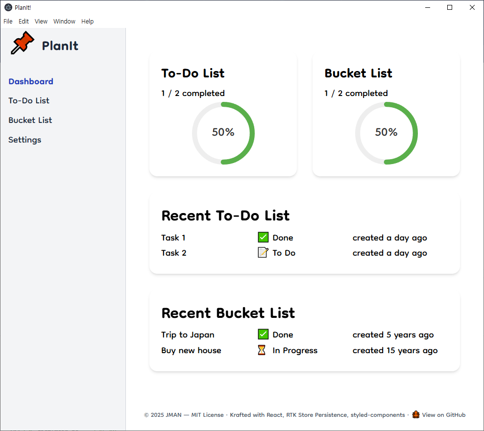
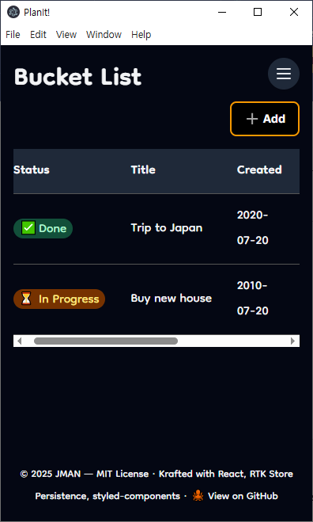

# PlanIt
A personal task planner built with React, TypeScript, Vite, and Electron.


## 📸 Screenshots







## Features
- Task tracking with status and dates
- Bucket list management
- State management with Redux Toolkit
- Dark mode toggle with full Tailwind theming
- REST-style API abstraction over local storage
- Modular UI built with Tailwind CSS V4
- Responsive design for all devices
- Cross-platform desktop support via Electron
- Clean project structure for easy scaling


## Tech Stack
- **Frontend Framework**: React with TypeScript
- **Styling**: Tailwind CSS V4
- **State Management**: Redux Toolkit + redux-persist
- **Desktop Runtime**: Electron
- **Development Environment**: Vite, pnpm, tsup, electronmon, concurrently


## Monorepo Layout
The codebase is structured in a monorepo-like format for scalability:
```
├── apps/          # Contains the main applications
│ ├── styled/      # Main app built with styled-component (legacy)
│ ├── tailwind/    # Main app built with Tailwind CSS V4 & Electron renderer process
│ └── electron/    # Electron main & preload process
├── public/        # Sharing public resources
├── packages/      # Shared libraries or utilities
```


## Project Structure
```
src/
├── api/           # API modules and abstractions
├── components/    # Reusable UI components
├── hooks/         # Custom React hooks
├── pages/         # Route-level components
├── store/         # RTK store and slices
├── types/         # TypeScript type definitions
└── ui/            # UI components and styles
```


## Setup for Development
### Prerequisites
- Node.js (v16 or higher)
- pnpm (v8 or higher)


### Getting Started
1. Clone the repository:
```bash
git clone https://github.com/jman-9/planit.git
cd planit
```

2. Install dependencies:
```bash
pnpm install
```


### Running the Web App
1. Start the development server:
```bash
cd apps/tailwind
pnpm dev
```

2. Open your browser and navigate to `http://localhost:5173`


### Running the Desktop App (Electron)
1. Approve local build scripts (one-time):
```bash
cd apps/electron
pnpm approve-builds
# select and allow electron build script
```

2. Start the development app:
```bash
pnpm dev
```


## 🚧 Future Work
- Replace `electron-store` with a structured database


## Contributing
Open a Pull Request


## License
This project is licensed under the MIT License - see the [LICENSE](LICENSE) file for details.
