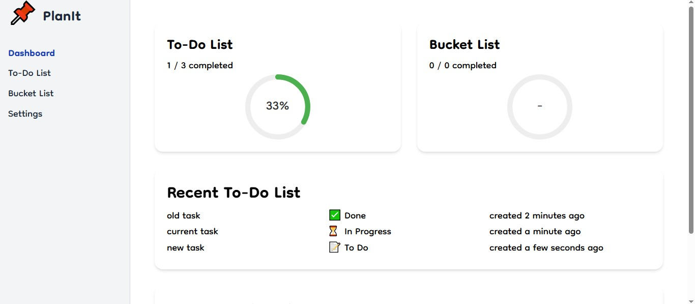
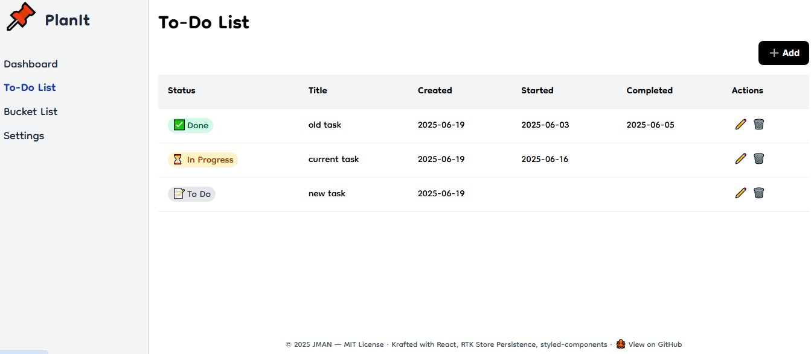
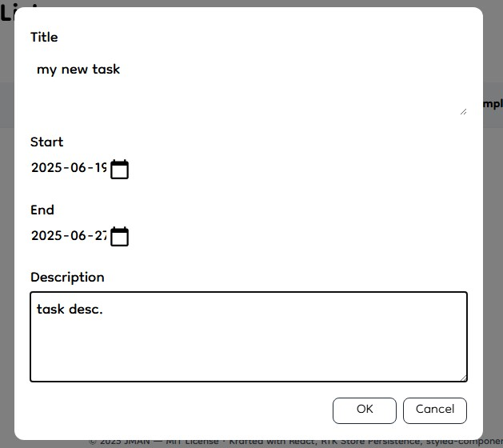
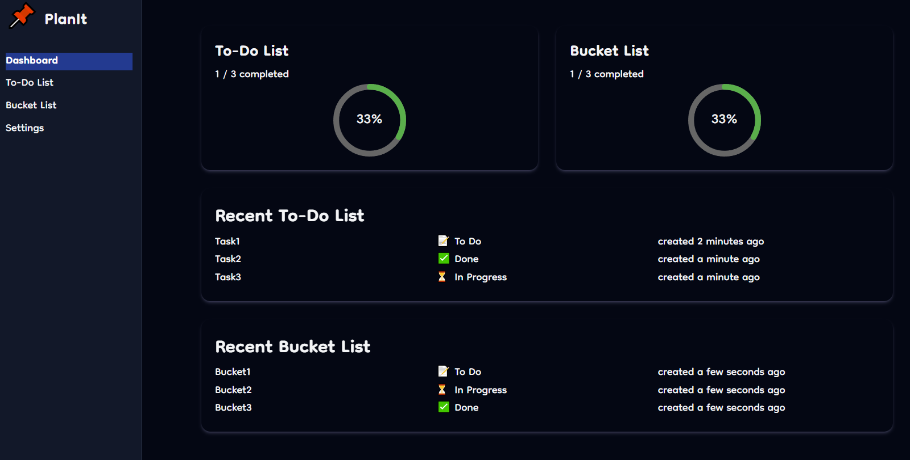
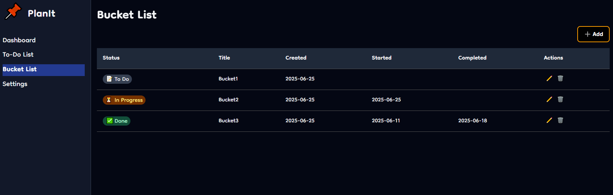

# PlanIt
A personal task planner built with React, TypeScript, and Vite.


## 📸 Screenshots











## Features
- Task tracking with status and dates
- Bucket list management
- State management with Redux Toolkit
- Dark mode toggle with full Tailwind theming
- REST-style API abstraction over local storage
- Modular UI built with Tailwind CSS V4
- Responsive design for all devices
- Clean project structure for easy scaling


## Tech Stack
- **Frontend Framework**: React with TypeScript
- **Build Tool**: Vite
- **Package Manager**: pnpm
- **Styling**: Tailwind CSS V4
- **State Management**: Redux Toolkit + redux-persist


## Monorepo Layout
The codebase is structured in a monorepo-like format for scalability:
```
├── apps/          # Contains the main applications
│ ├── styled/      # Main app built with styled-component (legacy)
│ └── tailwind/    # Main app built with Tailwind CSS V4
├── public/        # Sharing public resources
├── packages/      # Reserved for future shared libraries or utilities
```


## Project Structure
```
src/
├── api/           # API modules and abstractions
├── components/    # Reusable UI components
├── hooks/         # Custom React hooks
├── pages/         # Route-level components
├── store/         # RTK store and slices
├── types/         # TypeScript type definitions
└── ui/            # UI components and styles
```


## Getting Started
### Prerequisites
- Node.js (v16 or higher)
- pnpm (v8 or higher)


### Installation
1. Clone the repository:
```bash
git clone https://github.com/jman-9/planit.git
cd planit
```

2. Install dependencies:
```bash
pnpm install
```

3. Start the development server:
```bash
cd apps/tailwind
pnpm dev
```

4. Open your browser and navigate to `http://localhost:5173`


## Contributing
Open a Pull Request


## License
This project is licensed under the MIT License - see the [LICENSE](LICENSE) file for details.
